# Techniques: Clustering & Applications

## Key Terms and Definitions
- **Unsupervised Learning**: Extracting patterns from unlabeled data.
- **K-Means Clustering**: A centroid-based algorithm that partitions data into *k* clusters by minimizing within-cluster variance.
- **DBSCAN**: A density-based clustering algorithm that groups points based on local density and identifies outliers.
- **Elbow Method**: A heuristic for determining the optimal number of clusters by plotting the sum of squared errors (SSE) versus *k*.
- **Silhouette Score**: A metric (ranging from –1 to 1) that measures how similar an instance is to its own cluster versus other clusters.
- **Gaussian Mixture Models (GMM)**: Probabilistic models representing clusters as mixtures of Gaussian distributions.

---

## Learning Objectives
By the end of this lecture, students should be able to:

✅ Explain key unsupervised learning concepts and clustering techniques.  
✅ Use **K-Means** and **DBSCAN** in Python.  
✅ Use the elbow method and silhouette score to select the optimal number of clusters.

---

## 1. Introduction to Unsupervised Learning Techniques
### Introduction

Say you want to create a system that will take a few pictures of each item on a manufacturing production line and detect which items are defective. You can fairly easily create a system that will take pictures automatically, and this might give you thousands of pictures every day. You can then build a reasonably large dataset in just a few weeks. But wait, there are no labels! If you want to train a regular binary classifier that will predict whether an item is defective or not, you will need to label every single picture as “defective” or “normal.” This will generally require human experts to sit down and manually go through all the pictures. This is a long, costly, and tedious task, so it will usually only be done on a small subset of the available pictures. As a result, the labeled dataset will be quite small, and the classifier’s performance will be disappointing. Moreover, every time the company makes any change to its products, the whole process will need to be started over from scratch. Wouldn’t it be great if the algorithm could just exploit the unlabeled data without needing humans to label every picture? Enter unsupervised learning.

*Why is this important?*  
- **Data Abundance**: We often have the features (X) without labels (y).  
- **Cost Efficiency**: Manual labeling is expensive and time-consuming.  
- **Applications**: From defect detection on a production line to image segmentation—unsupervised techniques unlock vast potential.

---

## 2. Clustering – The Core Unsupervised Task

Clustering is one of the most fundamental tasks in unsupervised learning. Its goal is to group similar instances together so that data points within the same cluster share common characteristics, while those in different clusters are significantly different. This process is invaluable for data exploration, pattern discovery, and as a precursor for more advanced tasks like anomaly detection and semi-supervised learning.

Imagine embarking on a hike in a mountainous region. Along the trail, you encounter a variety of plants—some familiar, some entirely new. Even without expert knowledge, you might naturally group these plants based on observable similarities, such as leaf shape, color, or size. This intuitive grouping mirrors what clustering algorithms achieve: they partition data based on inherent similarities in the absence of any pre-assigned labels.

Clustering finds applications in many domains, including:

- **Customer Segmentation:** Grouping customers based on purchasing behavior or website interactions to better target marketing strategies.
- **Data Analysis:** Uncovering natural groupings within data to gain insights into underlying trends.
- **Dimensionality Reduction:** Representing high-dimensional data in a more compact form by replacing raw features with cluster affinity scores.
- **Anomaly Detection:** Identifying data points that do not conform to the dominant patterns, which might indicate defects, fraud, or novel phenomena.
- **Image Segmentation:** Dividing an image into meaningful regions (e.g., grouping pixels of similar color) to simplify further analysis or object detection.
- **Semi-Supervised Learning:** Propagating labels from a few labeled examples to a larger unlabeled dataset based on cluster membership.

Figure 2 illustrates a visual example of clustering in action. It reinforces the idea that, while traditional classification relies on known labels, clustering leverages the underlying structure of data to form meaningful groups without prior knowledge.

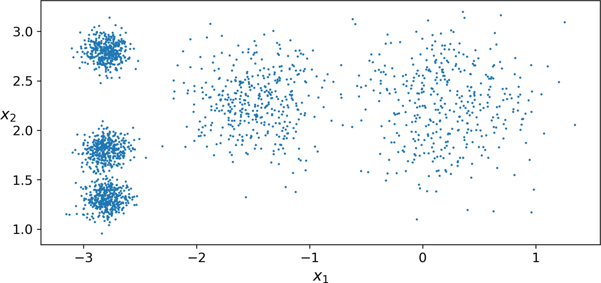

Clustering algorithms come in many flavors—each designed to handle different types of data distributions and structures. Whether it’s partitional methods like K-Means, density-based approaches like DBSCAN, or probabilistic models like Gaussian Mixture Models, the choice of algorithm depends on the specific characteristics of your dataset.

In the upcoming sections, we will delve deeper into these methods—starting with a detailed exploration of K-Means. We will examine its algorithmic steps, mathematical underpinnings, and practical implementation, providing you with a robust foundation for understanding and applying clustering techniques in real-world scenarios.

---

## 3. K-Means Clustering

K-Means is one of the most widely used clustering algorithms due to its simplicity and efficiency. It aims to partition an unlabeled dataset into *k* distinct clusters by minimizing the variance within each cluster.

### 3.1 Concept and Intuition

The central idea behind K-Means is to find a set of *k* centroids that best represent the data. Each data point is then assigned to the cluster whose centroid is nearest. This results in clusters where the intra-cluster similarity is maximized, and the inter-cluster similarity is minimized.

For example, imagine you have a set of unlabeled data points that naturally form five distinct groups (blobs). K-Means will try to find the central point (centroid) of each blob and then assign every data point to its nearest centroid. Over successive iterations, both the assignments and the centroids get refined until the algorithm converges.

### 3.2 Mathematical Foundation

The algorithm minimizes the following objective function:

$$
J = \sum_{i=1}^{k} \sum_{x \in C_i} \| x - \mu_i \|^2
$$

- $C_i$: The set of points assigned to cluster $i$.
- $\mu_i$: The centroid (mean) of cluster $i$.
- $\| x - \mu_i \|$: The Euclidean distance between a data point $x$ and the centroid $\mu_i$.

Minimizing $J$ ensures that the clusters are as compact as possible.

### 3.3 Algorithm Steps

The K-Means algorithm typically follows these steps:

1. **Initialization**: Randomly select *k* initial centroids from the dataset. (Alternatively, use a smarter initialization like K-Means++ to improve convergence.)
2. **Assignment Step**: Assign each data point to the nearest centroid, forming *k* clusters.
3. **Update Step**: Recalculate each centroid as the mean of all points assigned to that cluster.
4. **Iteration**: Repeat the assignment and update steps until the centroids no longer change significantly (i.e., convergence).

#### **Pseudocode**
```plaintext
1. Initialize k centroids randomly.
2. Repeat:
    a. For each data point, assign it to the cluster with the nearest centroid.
    b. Update centroids by computing the mean of the points in each cluster.
3. Until convergence.
```

### 3.4 Python Implementation

Below is a sample Python implementation using Scikit-Learn:

```python
from sklearn.cluster import KMeans
import numpy as np

# Assume X is your dataset (e.g., a 2D NumPy array of shape [n_samples, n_features])
k = 5
kmeans = KMeans(n_clusters=k, init='k-means++', n_init=10)
y_pred = kmeans.fit_predict(X)

# Output the cluster centroids
print("Cluster Centroids:\n", kmeans.cluster_centers_)

# Predicting clusters for new instances
X_new = np.array([[0, 2], [3, 2], [-3, 3], [-3, 2.5]])
predictions = kmeans.predict(X_new)
print("Predicted Clusters for new data:\n", predictions)
```

### 3.5 Visualizing the Process

When K-Means assigns clusters, the decision boundaries can be visualized as a Voronoi tessellation, where each region is defined by the nearest centroid. For example:

- **Figure 3** shows the K-Means decision boundaries. In this visualization, each centroid is marked (often with an "X"), and the space is divided into regions (or cells) around these centroids.

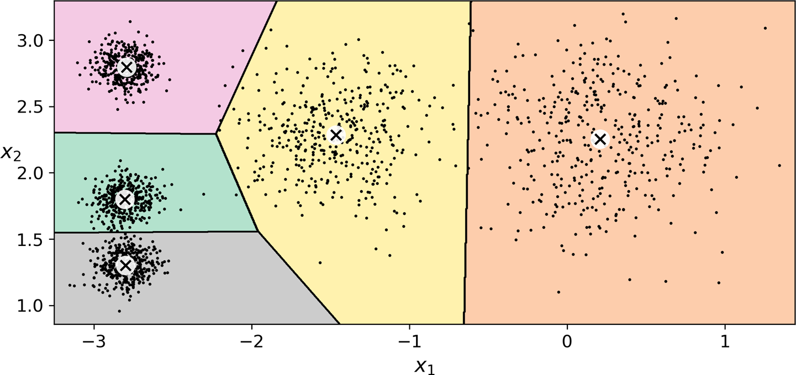

- **Figure 4** illustrates the iterative process of K-Means. It shows the initial random placement of centroids (top left), the first assignment of data points (top right), the updated centroids (center left/right), and how the algorithm converges after a few iterations.

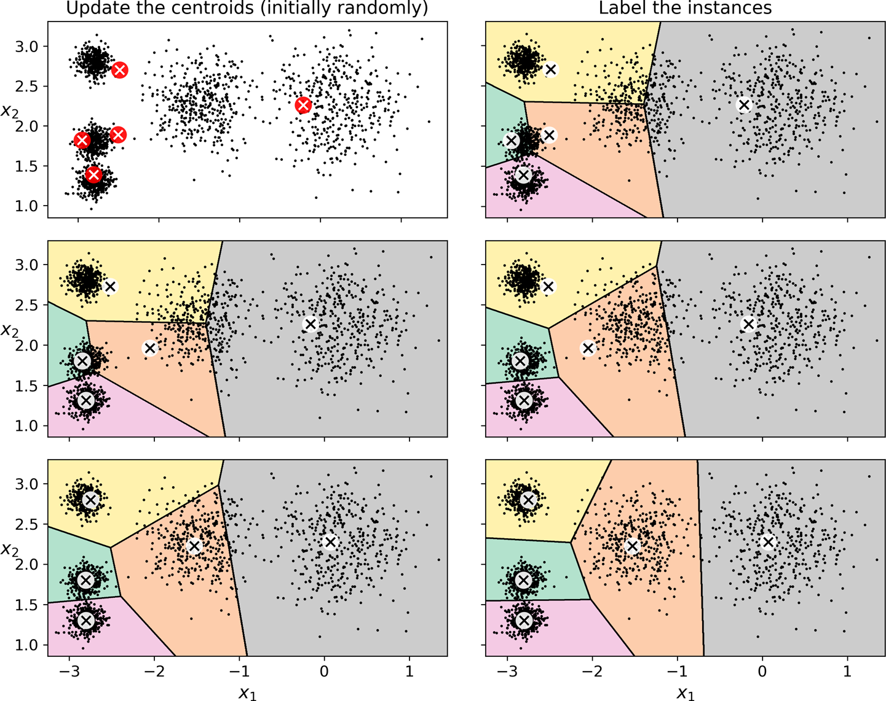

- **Figure 5** demonstrates potential pitfalls in centroid initialization. It shows two suboptimal clustering solutions that K-Means may converge to if the initial centroids are not well-chosen. These suboptimal outcomes underscore the importance of proper initialization (e.g., using K-Means++).

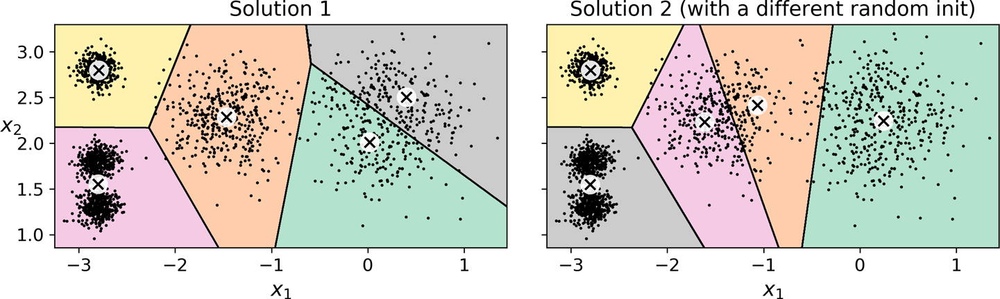

### 3.6 Discussion and Best Practices

- **Initialization Matters**: Random initialization can sometimes lead to suboptimal clustering. Consider using K-Means++ for smarter initialization.
- **Scalability**: K-Means is efficient and scales well with large datasets. However, its performance depends on the clustering structure inherent in the data.
- **Dimensionality Reduction**: For high-dimensional datasets, you can transform the data into a lower-dimensional space (using techniques like PCA) before applying K-Means.
- **Soft Clustering**: While K-Means performs hard assignments (each point belongs to one cluster), sometimes it is useful to compute the distance of a point to each centroid (using the `transform()` method) to obtain a soft clustering measure.

K-Means is a powerful tool in the unsupervised learning toolbox. Its simplicity and efficiency make it a popular choice, yet it is important to understand its limitations, particularly when dealing with clusters of varying shapes and densities.

In the next sections, we will explore methods for selecting the optimal number of clusters and introduce alternative clustering algorithms like DBSCAN.

---

## 4. Selecting the Number of Clusters

Choosing the optimal number of clusters (*k*) is a critical step in clustering because it directly influences the quality and interpretability of the results. Inadequate choices may merge distinct groups or split naturally coherent groups into too many parts.

### 4.1 The Importance of Choosing *k*

- **Impact on Quality**: The value of *k* determines how well the clustering algorithm captures the underlying structure in the data. Too few clusters can force distinct groups together, while too many clusters can split a natural group unnecessarily.
- **Trade-offs**: Balancing the complexity of the model with the need for meaningful clusters is essential. A proper choice of *k* leads to clusters that are both compact (low intra-cluster variability) and well-separated (high inter-cluster differences).

**Figure 6** illustrates the pitfalls of choosing *k* too low (merging distinct groups) or too high (splitting groups unnecessarily):

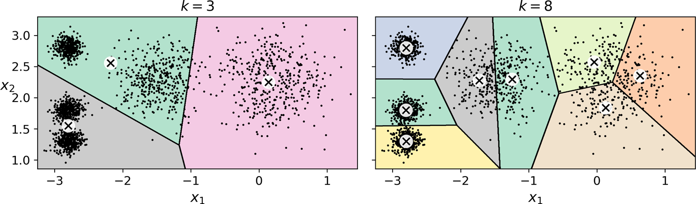

### 4.2 The Elbow Method and Inertia

The Elbow Method is a common approach for determining the optimal number of clusters by examining the inertia of the model. **Inertia** is a measure of how internally coherent the clusters are; in other words, it quantifies how tightly the data points in a cluster are grouped together. As you increase the number of clusters, inertia naturally decreases because more centroids will reduce the distance between data points and their assigned centroids. However, after a certain point, adding more clusters results in only marginal improvements, creating an "elbow" in the plot.

#### 4.2.1 Inertia: Mathematical Formulation

Inertia is defined as the sum of squared distances between each data point and the centroid of the cluster to which it belongs. Mathematically, if we denote:

- $ k $ as the number of clusters,
- $ C_i $ as the set of data points in cluster $ i $,
- $ \mu_i $ as the centroid of cluster $ i $,
- $ x $ as an individual data point in $ C_i $,

then the inertia $ J $ is given by:

$$
J = \sum_{i=1}^{k} \sum_{x \in C_i} \| x - \mu_i \|^2
$$

Here, $ \| x - \mu_i \|^2 $ represents the squared Euclidean distance between a data point $ x $ and the centroid $ \mu_i $. The goal of the K-Means algorithm is to minimize this inertia during its iterative process of cluster assignment and centroid update.

A lower inertia value suggests that the clusters are more compact and that the data points are closer to their respective centroids. However, it is important to note that inertia will always decrease as $ k $ increases, even if additional clusters do not provide any meaningful separation. Therefore, the "elbow" point—where the decrease in inertia begins to level off—is used as an indicator of the optimal number of clusters.

By plotting inertia against various values of $ k $, you can visually inspect where adding another cluster does not yield a significant reduction in inertia. This inflection point is where you would ideally set the number of clusters for your analysis.

**Figure 7** shows the inertia plot where the elbow is visible around *k = 4*. Beyond this point, the reduction in inertia tapers off, suggesting that additional clusters may not yield significant improvements.

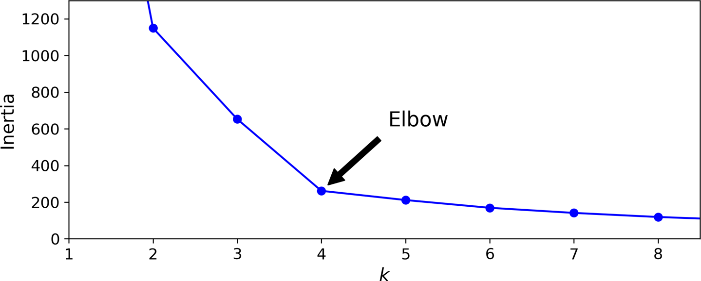


### 4.3 Silhouette Analysis

For a more nuanced evaluation, the **Silhouette Score** measures how similar an instance is to its own cluster compared to other clusters. The silhouette coefficient for a data point is given by:

$$
s = \frac{b - a}{\max(a, b)}
$$

- **Where**:
    - $a$ is the average distance to all other points within the same cluster (intra-cluster distance).
    - $b$ is the average distance to points in the nearest cluster (inter-cluster distance).

- **Interpretation**:
    - **Close to 1**: The instance is well inside its cluster and far from others.
    - **Around 0**: The instance is on or very near the decision boundary.
    - **Negative Values**: The instance might be assigned to the wrong cluster.

**Figure 8** depicts how the overall silhouette score varies with different *k* values. In this example, both *k = 4* and *k = 5* produce high scores, with a slight edge for *k = 4*. However, if similar cluster sizes are desired, *k = 5* might be preferred.

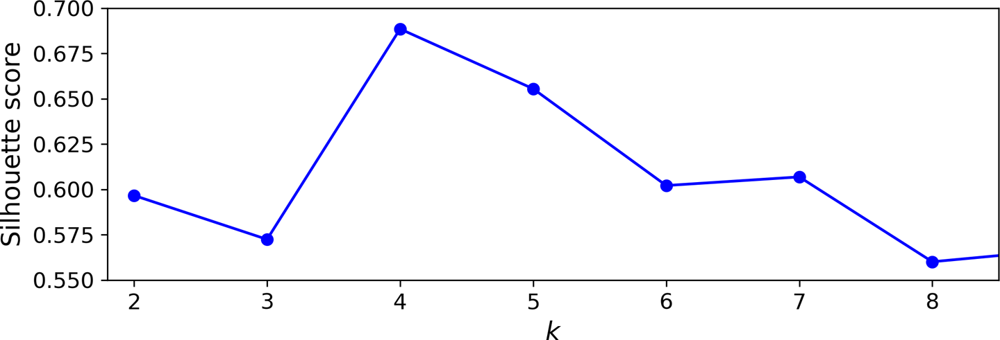

As you can see, this visualization is much richer than the previous one: although it confirms that k = 4 is a very good choice, it also underlines the fact that k = 5 is quite good as well, and much better than k = 6 or 7. This was not visible when comparing inertias.

An even more informative visualization is obtained when you plot every instance’s silhouette coefficient, sorted by the cluster they are assigned to and by the value of the coefficient. This is called a silhouette diagram (see Figure 9). Each diagram contains one knife shape per cluster. The shape’s height indicates the number of instances the cluster contains, and its width represents the sorted silhouette coefficients of the instances in the cluster (wider is better). The dashed line indicates the mean silhouette coefficient.

**Figure 9** provides a detailed silhouette diagram. Each cluster is represented by a “knife-shaped” plot where the width corresponds to the silhouette coefficients of the instances in that cluster. Wider shapes generally indicate more cohesive clusters with fewer borderline cases.

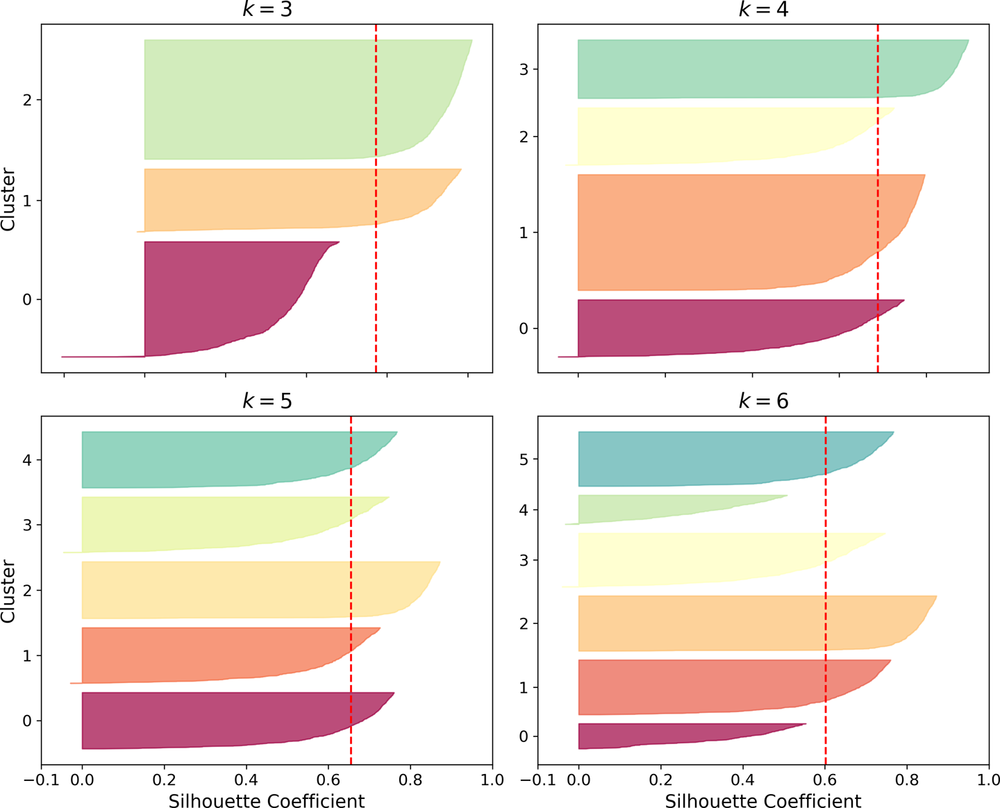

#### 4.3.1 Silhouette Diagram Explanation

- **Knife-Shaped Plots**: Each cluster’s silhouette coefficients are plotted as a horizontal bar (or "knife shape") after sorting them from lowest to highest. The term "knife-shaped" is used because the plot resembles the cross-section of a knife blade:
    - **Wider Shapes**: A wider bar indicates that many data points in the cluster have high silhouette coefficients, suggesting that the points are well within the boundaries of the cluster with good separation from neighboring clusters.
    - **Narrow Shapes**: Conversely, a narrow silhouette plot for a cluster suggests that fewer data points have strong cluster membership, which may indicate the presence of many borderline or ambiguous points.

- **Dashed Line**: A vertical dashed line often marks the overall average silhouette score across all clusters. If many data points in a cluster have silhouette values that fall below this average, it might signal that the cluster is less well-defined.

- **Visual Insight**: The silhouette diagram allows you to see the distribution of the silhouette coefficients for each cluster. This detailed view can help diagnose problems like clusters with too many borderline cases, thereby guiding you in fine-tuning your choice of *k* or in considering alternative clustering strategies.

Together, these two visualizations provide both an aggregate view and a detailed, per-cluster analysis of how well the clusters have been formed. They are essential tools for validating the quality of your clustering results and making informed decisions about the optimal number of clusters.

### 4.4 Practical Considerations

- **Combination of Techniques**: While the elbow method offers a quick visual estimate, the silhouette score provides a quantitative assessment. In practice, it is beneficial to use both techniques in tandem.
- **Domain Knowledge**: Often, domain-specific insights can guide the final choice of *k*. Consider how many meaningful groups might exist based on the problem context.
- **Computational Costs**: Keep in mind that as *k* increases, the computational burden for clustering and evaluation may also rise. Efficiently balancing these considerations is key to a successful analysis.

By carefully analyzing the inertia and silhouette plots—and leveraging domain knowledge—one can select an optimal value for *k* that balances simplicity with the richness of the underlying data structure.

---

## 5. Limits of K-Means

While K-Means is popular due to its simplicity and speed, it is important to recognize its limitations. Understanding these limitations helps you decide when K-Means is appropriate and when alternative clustering methods might be a better choice.

### 5.1 Sensitivity to Cluster Shape and Size

- **Spherical Clusters Assumption**:  
  K-Means assumes that clusters are roughly spherical and evenly sized. This assumption can lead to poor performance when clusters have:
    - **Varying sizes**: Smaller clusters may be absorbed into larger ones.
    - **Different densities**: Sparse clusters can be misclassified.
    - **Non-spherical shapes**: Elongated or irregularly shaped clusters can be split or merged improperly.

- **Figure 10** illustrates a common failure case. In this example, the dataset consists of three ellipsoidal clusters with varying dimensions, densities, and orientations. Notice how K-Means either chops off parts of a cluster or incorrectly merges segments of distinct clusters—even though the overall inertia might be lower. This happens because K-Means only considers the Euclidean distance to the centroids.

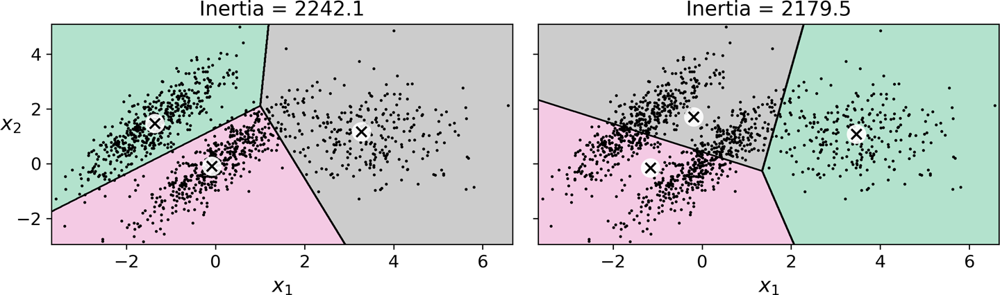

### 5.2 Sensitivity to Initialization

- **Local Optima**:  
  The outcome of K-Means depends on the initial positions of the centroids. Poor initialization can lead the algorithm to converge to a local optimum, resulting in suboptimal clusters.
- **Mitigation Strategies**:
    - **Multiple Runs**: Run the algorithm several times with different initializations and select the solution with the lowest inertia.
    - **K-Means++ Initialization**: A smarter initialization method that spreads out the initial centroids, reducing the likelihood of poor convergence.

### 5.3 Sensitivity to Outliers

- **Effect of Outliers**:  
  Outliers can significantly skew the positions of the centroids. Since K-Means minimizes the squared distances, a few extreme points can pull a centroid away from the true center of a cluster.
- **Workarounds**:
    - **Preprocessing**: Remove or down-weight outliers before applying K-Means.
    - **Robust Clustering Methods**: Consider algorithms that are less sensitive to outliers, such as DBSCAN or Gaussian Mixture Models.

### 5.4 Scalability Considerations

- **Computational Complexity**:  
  Although K-Means is generally fast and scales linearly with the number of instances when the data has a clear clustering structure, its performance can degrade in the worst-case scenario, especially when the data does not have well-defined clusters.
- **Mini-Batch K-Means**:  
  For very large datasets, mini-batch K-Means offers a faster alternative by updating centroids with small subsets of data. However, this approach may result in slightly higher inertia.

### 5.5 Summary

K-Means is a powerful clustering tool when used under the right conditions. However, its assumptions about cluster shape, size, and density, along with its sensitivity to initialization and outliers, limit its effectiveness in certain scenarios. In practice, it's essential to evaluate whether your data meets these assumptions and to consider alternative clustering methods (such as DBSCAN, hierarchical clustering, or Gaussian Mixture Models) when it does not.

By recognizing these limitations, you can better decide when to use K-Means and how to preprocess your data to achieve the best possible clustering results.

---

## 6. Applications of K-Means Clustering

K-Means clustering is not only a method for grouping similar data points—it also plays a crucial role in many real-world applications. In this section, we explore several practical applications of K-Means, including image segmentation, preprocessing for classification, and semi-supervised learning.

### 6.1 Image Segmentation

Image segmentation is the process of partitioning an image into meaningful segments. A common task is color segmentation, where pixels with similar colors are grouped together. This is useful for various tasks such as:
- **Analyzing satellite images** to estimate forest cover.
- **Object detection** in self-driving cars by separating different object types.
- **Simplifying images** for further analysis by reducing the number of unique colors.

**Workflow Example:**
1. **Load an Image**: Use a library (e.g., Matplotlib or imageio) to load your image.
2. **Reshape the Image**: Convert the 3D image array (height × width × color channels) into a 2D array where each row represents a pixel's RGB values.
3. **Apply K-Means**: Cluster the pixel colors (commonly using *k* = 8) so that similar colors are grouped together.
4. **Reconstruct the Image**: Replace each pixel's color with its cluster’s centroid color and reshape the data back to the original dimensions.

```python
from matplotlib.image import imread
from sklearn.cluster import KMeans
import matplotlib.pyplot as plt

# Load the image
image = imread('./figures/ladybug.png')
print("Image shape:", image.shape)

# Reshape the image to a 2D array of pixels (each row is RGB)
X = image.reshape(-1, 3)

# Apply K-Means clustering with k = 8
k = 8
kmeans = KMeans(n_clusters=k, init='k-means++', n_init=10)
labels = kmeans.fit_predict(X)

# Replace each pixel's color with its corresponding centroid color
segmented_img = kmeans.cluster_centers_[labels]
segmented_img = segmented_img.reshape(image.shape)

# Display the segmented image
plt.imshow(segmented_img.astype('uint8'))
plt.title("Segmented Image with k = 8")
plt.show()
```

**Figure 11** shows the outcome of image segmentation using K-Means. Notice how the original image is reduced to a few distinct color regions, which can simplify further image analysis tasks.

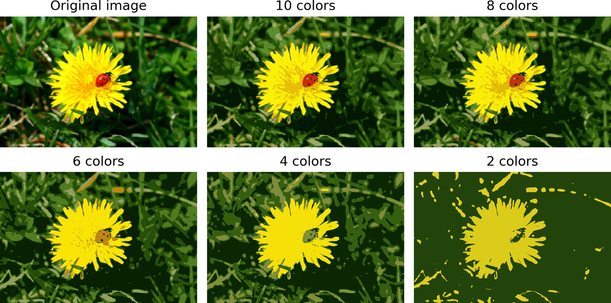

### 6.2 Preprocessing for Classification

K-Means can also serve as a powerful preprocessing step for supervised learning. Consider the digits dataset (a simplified MNIST-like dataset). Instead of working with raw pixel values, you can:
- **Cluster the training data** into a higher number of clusters (e.g., 50 clusters).
- **Transform each image** into a feature vector representing its distances to the cluster centroids.
- **Use the transformed features** as input to a classifier (e.g., Logistic Regression).

This strategy can capture nonlinear relationships in the data and often leads to improved classification accuracy.

```python
from sklearn.datasets import load_digits
from sklearn.model_selection import train_test_split
from sklearn.linear_model import LogisticRegression
from sklearn.pipeline import Pipeline

# Load the digits dataset
X_digits, y_digits = load_digits(return_X_y=True)
X_train, X_test, y_train, y_test = train_test_split(X_digits, y_digits, random_state=42)

# Baseline: Train Logistic Regression on raw data
log_reg = LogisticRegression(max_iter=10000)
log_reg.fit(X_train, y_train)
print("Baseline accuracy:", log_reg.score(X_test, y_test))

# Create a pipeline: first perform K-Means clustering, then apply Logistic Regression
pipeline = Pipeline([
    ("kmeans", KMeans(n_clusters=50, init='k-means++', n_init=10)),
    ("log_reg", LogisticRegression(max_iter=10000))
])
pipeline.fit(X_train, y_train)
print("Pipeline accuracy:", pipeline.score(X_test, y_test))
```

### 6.3 Semi-Supervised Learning and Label Propagation

In many real-world scenarios, labeled data is scarce. K-Means can assist in semi-supervised learning through label propagation:
- **Cluster the Data**: Run K-Means on the unlabeled data.
- **Identify Representative Instances**: For each cluster, select the instance closest to the centroid.
- **Manually Label Representatives**: Label these representative samples.
- **Propagate the Labels**: Assign the representative label to all instances in the same cluster.
- **Refine the Labels**: Optionally, propagate labels only to instances near the centroid (e.g., the 20% closest).

```python
# Assume X_train is the training data
k = 50
kmeans = KMeans(n_clusters=k, init='k-means++', n_init=10)
X_digits_dist = kmeans.fit_transform(X_train)

# Find the representative (closest) instance for each cluster
representative_digit_idx = np.argmin(X_digits_dist, axis=0)
X_representative_digits = X_train[representative_digit_idx]

# Manually label these representatives (example labels provided)
y_representative_digits = np.array([4, 8, 0, 6, 8, 3, 7, 1, 2, 9, 5, 3, 4, 2, 1, 0, 7, 8, 9, 3,
                                     4, 5, 2, 1, 0, 7, 8, 9, 3, 4, 5, 2, 1, 0, 7, 8, 9, 3, 4, 5,
                                     2, 1, 0, 7, 8, 9, 3, 4, 5])  # example labels

# Propagate the labels to all instances in each cluster
y_train_propagated = np.empty(len(X_train), dtype=np.int32)
for i in range(k):
    y_train_propagated[kmeans.labels_ == i] = y_representative_digits[i]

# Train a classifier on the propagated labels
log_reg = LogisticRegression(max_iter=10000)
log_reg.fit(X_train, y_train_propagated)
print("Accuracy after label propagation:", log_reg.score(X_test, y_test))
```

**Figure 12** displays the representative digit images (one per cluster) extracted from the digits dataset. These images serve as the basis for label propagation, demonstrating how a few well-chosen samples can represent an entire dataset.

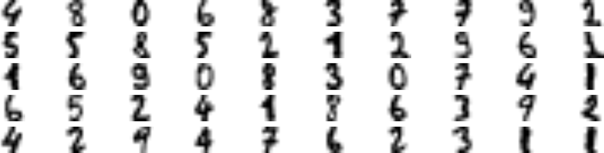

### 6.4 Summary of K-Means Applications

K-Means clustering is versatile and can be applied to:
- **Image Segmentation**: Simplify and segment images by grouping similar colors.
- **Preprocessing**: Transform raw data into informative feature representations for classification.
- **Semi-Supervised Learning**: Boost performance when labeled data is limited by propagating labels from representative samples.

These applications illustrate the broader role of K-Means not just as a clustering algorithm but as a valuable component in diverse machine learning pipelines.

---

## 7. DBSCAN – Density-Based Clustering

DBSCAN (Density-Based Spatial Clustering of Applications with Noise) offers an alternative approach to clustering. Unlike K-Means, which requires specifying the number of clusters in advance and assumes spherical clusters, DBSCAN defines clusters based on the density of data points, allowing it to detect clusters of arbitrary shapes and identify noise.

### 7.1 Concept and Intuition

DBSCAN classifies points into three categories:
- **Core Points**: Points that have at least a minimum number (`min_samples`) of neighboring points within a specified radius (`eps`).
- **Border Points**: Points that are not core points but lie within the neighborhood of a core point.
- **Noise Points**: Points that are neither core nor border points (often labeled as –1).

This density-based approach enables DBSCAN to find clusters regardless of their shape and to automatically determine the number of clusters based on the data’s inherent structure.

### 7.2 Algorithm Steps

1. **For each point in the dataset**:
    - Compute its ε-neighborhood (all points within a distance `eps`).
    - If the number of neighbors is at least `min_samples`, mark the point as a core point.
2. **Cluster Formation**:
    - Connect core points that are within each other’s ε-neighborhoods.
    - Assign border points to the nearest core point’s cluster.
    - Label points that do not belong to any cluster as noise (–1).


### 7.3 Python Implementation

Consider the “moons” dataset—a common benchmark for non-convex clusters. DBSCAN can capture the intertwined, crescent shapes effectively:

```python
from sklearn.cluster import DBSCAN
from sklearn.datasets import make_moons
import matplotlib.pyplot as plt

# Generate a moons dataset
X, _ = make_moons(n_samples=1000, noise=0.05)

# Apply DBSCAN with eps=0.05 and min_samples=5
dbscan = DBSCAN(eps=0.05, min_samples=5)
dbscan.fit(X)
labels = dbscan.labels_

# Visualize the DBSCAN clustering results
plt.scatter(X[:, 0], X[:, 1], c=labels, cmap='viridis', edgecolor='k')
plt.title("DBSCAN Clustering on Moons Dataset")
plt.xlabel("Feature 1")
plt.ylabel("Feature 2")
plt.show()
```

### 7.4 Visual Explanation

**Figure 13** shows the DBSCAN result with a small `eps` value. Many points are classified as noise, and several small clusters are formed.

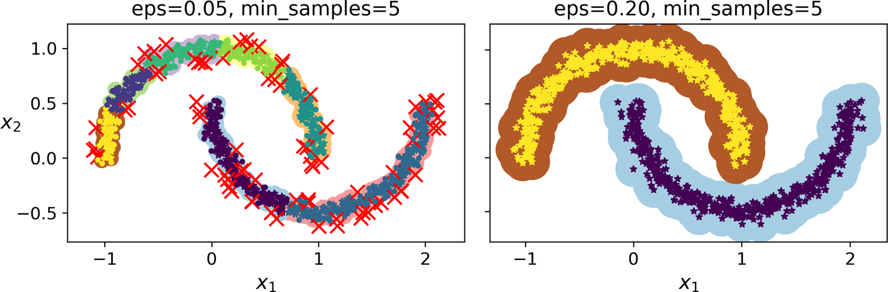

Increasing the neighborhood radius can improve clustering. **Figure 14** depicts the DBSCAN result with `eps` increased to 0.2. The clusters are more coherent, and fewer points are labeled as noise.

### 7.5 Extending DBSCAN with Nearest Neighbors

Since DBSCAN lacks a built-in `predict()` method for new data, one common workaround is to use a k-Nearest Neighbors (kNN) classifier trained on the core points. This allows you to approximate the cluster assignment for unseen instances.

```python
from sklearn.neighbors import KNeighborsClassifier

# Train a kNN classifier using the core points from DBSCAN
core_samples = dbscan.core_sample_indices_
knn = KNeighborsClassifier(n_neighbors=50)
knn.fit(X[core_samples], labels[core_samples])

# Predict cluster assignments for new instances
X_new = np.array([[-0.5, 0], [0, 0.5], [1, -0.1], [2, 1]])
predicted_clusters = knn.predict(X_new)
print("Predicted clusters for new instances:", predicted_clusters)
```

**Figure 15** illustrates the decision boundaries of the kNN classifier trained on DBSCAN core points. New points are assigned to clusters based on their proximity to the core points. Note that without a distance threshold, the classifier will assign a cluster label even to points far away from any core cluster.

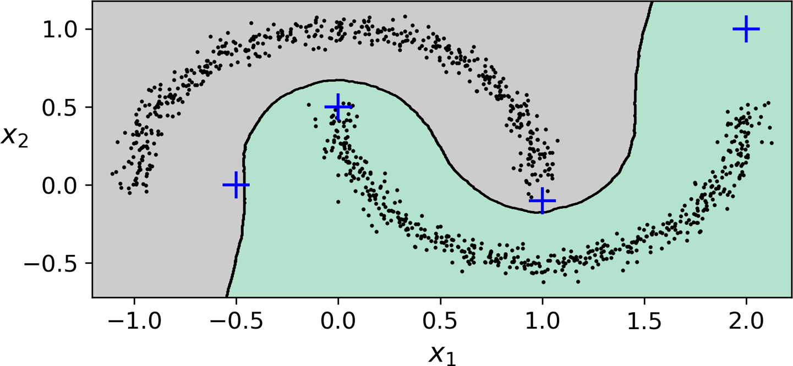

### 7.6 Summary of DBSCAN

DBSCAN is particularly effective when:
- The data contains clusters of arbitrary shapes.
- It is important to detect noise or outliers.
- The number of clusters is not known a priori.

Its reliance on local density, rather than global measures like inertia, makes DBSCAN robust in scenarios where methods like K-Means struggle—especially with irregular cluster shapes and noisy data.